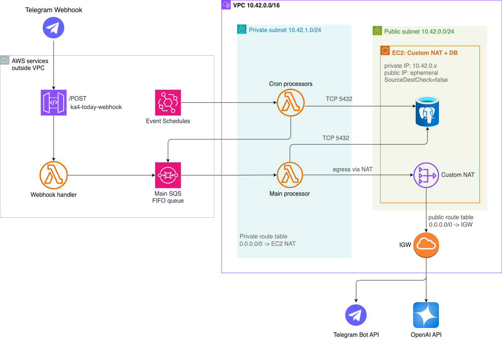

# ka4-today-bot

A lightweight, serverless Telegram bot built with AWS Lambda, OpenAI Responses API, and Node.js.  
It processes a simple webhook message, interacts with OpenAI to generate a response, and sends it back via Telegram.

---

## 📐 Architecture

[//]: # ()

[//]: # (<br>)

- **Telegram webhook flow** uses **API Gateway (HTTP API)** to invoke a lightweight Lambda.
  That handler validates the Telegram secret token and pushes inbound updates to **Amazon SQS**.
- **Amazon SQS FIFO** decouples delivery from processing, keeps messages ordered per Telegram
  `chat.id`, and deduplicates webhook and daily scheduled messages.
- The **async processor Lambda** consumes queue messages with controlled concurrency
  (`MaximumConcurrency: 2`) before routing each update through the Telegram command pipeline.
- **Daily scheduled delivery** runs through a dedicated cron Lambda that loads the users scheduled
  for the day and enqueues outbound work onto the same SQS queue.
- **Coach HTTP APIs** are exposed as separate **API Gateway (HTTP API)** Lambda handlers for
  client and exercise endpoints, isolated from the Telegram webhook path.
- **OpenAI Responses API** is used by the Telegram application layer to render prompt-driven
  replies and workout generation flows.
- **PostgreSQL** is the main application data store for Telegram users, prompts, message logs,
  clients, exercises, workouts, and workout schedules.
- **Structured logging** and shared HTTP helpers centralize error handling, request boundaries,
  and outbound integration behavior across Lambdas.

---

## ⭐ Features
- **Secure webhook** with x-telegram-bot-api-secret-token validation
- Handles /start command and registers user in DB
- Mark users as inactive users after receiving Telegram 403 errors (e.g., bot blocked)
- **Daily cron-based message broadcast** via ka4today-cron-daily-message Lambda
- **Personalized messages** based on OpenAI responses and the day of the week
- **Localization support** for messages (multi-language)
- **Prompt dictionary** stored in Postgres for consistent responses
- **Personalized workout generation** custom daily workout plan for the user, based on their preferences and available exercise
- **Progress image rendering** for the /progress command with Satori and resvg

---

## 🧩 Project Structure

```
src/
├── app/
│   └── config/          # Environment variables and app-level constants
├── shared/              # Cross-cutting helpers, HTTP utilities, logging, and shared types
├── infrastructure/
│   ├── integrations/    # Low-level Telegram and OpenAI clients
│   └── persistence/     # PostgreSQL and legacy DynamoDB persistence code
├── modules/
│   ├── telegram/
│   │   ├── handlers/    # Telegram Lambda entrypoints
│   │   ├── application/ # Telegram orchestration and services
│   │   ├── commands/    # Bot command implementations
│   │   ├── domain/      # Telegram-specific domain models
│   │   └── repository/  # Telegram read/write data access
│   └── coach/
│       ├── client/      # Coach client API, use cases, domain, and repository code
│       ├── exercise/    # Exercise API, use cases, domain, and repository code
│       └── workout/     # Reserved for coach workout functionality
template.yaml            # AWS SAM infrastructure template
scripts/                 # Local helper scripts
assets/                  # Static assets such as diagrams
.env.sample              # Local environment variables sample
```

---

## 🚀 Running Locally

> Requires Node.js 22+

1. Clone the repo
2. Copy a `.env.sample` file and rename it to `.env` :
3. Install dependencies:

```bash
npm install
```

4. Test individual handlers (via [AWS SAM CLI](https://docs.aws.amazon.com/serverless-application-model/latest/developerguide/serverless-sam-cli.html)):

Run entrypoint:
```bash
npm run local -- Ka4TodayTelegramWebhook event-samples/telegram-event.json
```

Run async processor
```bash
npm run local -- Ka4TodayAsyncTelegramProcessor event-samples/default-event.json
npm run local -- Ka4TodayAsyncTelegramProcessor event-samples/daily-event.json
npm run local -- Ka4TodayAsyncTelegramProcessor event-samples/daily-workout.json
npm run local -- Ka4TodayAsyncTelegramProcessor event-samples/start-event.json
```

### Prebuilt `resvg` Layer For Local `arm64`

The `/progress` command uses `@resvg/resvg-js`, which depends on a native Linux binary. For local
Apple Silicon development, the layer is prebuilt into `layers/resvg/dist` and then reused by SAM
with `SkipBuild: True`.

Rebuild the layer when `layers/resvg/package.json` changes:

```bash
mkdir -p layers/resvg/dist/nodejs
cp layers/resvg/package.json layers/resvg/dist/nodejs/package.json
docker run --rm \
  --platform linux/arm64 \
  -v "$PWD/layers/resvg/dist/nodejs:/var/task" \
  -w /var/task \
  public.ecr.aws/sam/build-nodejs22.x:latest-arm64 \
  npm ci --omit=dev
```

The progress image also needs `assets/Inter-Regular.ttf`. Keep that font in the prebuilt layer so
both local SAM and AWS Lambda can load it via `/opt/assets/Inter-Regular.ttf`:

```bash
mkdir -p layers/resvg/dist/assets
cp assets/Inter-Regular.ttf layers/resvg/dist/assets/Inter-Regular.ttf
```

After rebuilding the layer, build the function and run the event:

```bash
sam build Ka4TodayAsyncTelegramProcessor
npm run local -- Ka4TodayAsyncTelegramProcessor event-samples/progress.json
```

Run HttpApiClients
```bash
npm run local-api -- HttpApiClients
```

`HttpApiClients` is kept as a compatibility alias for the local API runner and currently expands to 
all HTTP API route functions in `scripts/genEnvJson.mjs`. 
If a new API route function is added in `template.yaml`, 
update that alias mapping as well so `sam local start-api` receives env vars for the new function.

---

## 🔎 Troubleshooting

- **Large SAM Artifact**
  
    Check artifact sizes after `sam build`:

  ```bash
  du -h .aws-sam/build/*
  ```

  Use this to track bundle growth after refactors or dependency changes. 
  If one Lambda suddenly becomes much larger than the others, inspect recent imports, 
  shared entrypoints, copied assets, and newly added dependencies.


- **Missing Env Vars In Local API**
  
    If one route works in `npm run local-api -- HttpApiClients` but another fails with missing env vars, check `scripts/genEnvJson.mjs`. 
    It must generate env blocks for every API route function used by `npm run local-api -- HttpApiClients`.


- **New Route Fails Only Locally**
  
    If a new HTTP API route was added in `template.yaml`, update the `HttpApiClients` 
    compatibility mapping in `scripts/genEnvJson.mjs` so the new route function also receives local env vars.

---

## ☁️ Deploying to AWS

### Validation

```
sam validate --lint -t stack/main.yaml
aws cloudformation validate-template --template-body file://stack/main.yaml
```

> Requires [AWS SAM CLI](https://docs.aws.amazon.com/serverless-application-model/latest/developerguide/serverless-sam-cli-install.html) and configured AWS credentials.

### One-time setup:

```bash
sam build
sam deploy
```

You will be prompted to enter your environment variables. These are saved to `samconfig.toml`.

### Or deploy manually:

```bash
sam deploy \
  --stack-name ka4-today-bot \
  --region eu-central-1 \
  --capabilities CAPABILITY_IAM \
  --parameter-overrides \
    NetworkStackExportPrefix=ka4-today
    
    
aws cloudformation deploy \
  --template-file stack/network-postgres-nat.yaml \
  --stack-name ka4-today \
  --capabilities CAPABILITY_IAM \
  --parameter-overrides \
    EnableInstanceSchedule=false \
    NamePrefix=ka4-today    
```

## ☁️ Delete all from AWS

```bash
aws cloudformation delete-stack --stack-name ka4-today-bot
```

---

## 🛠️ Environment Requirements

- Node.js 22.x
- AWS CLI + AWS SAM CLI
- AWS account with permissions to:
  - Deploy Lambda functions
  - Manage API Gateway (HTTP API)
  - Create IAM roles
- Telegram bot with webhook access (set via `setWebhook` API)
- OpenAI Responses API access

---

## License
All Rights Reserved.
© [2025] [Vitalii Kyrychenko]

This code and associated content may not be copied, modified, or distributed without explicit written permission.
This project is intended as a personal exploration and demonstration only.
