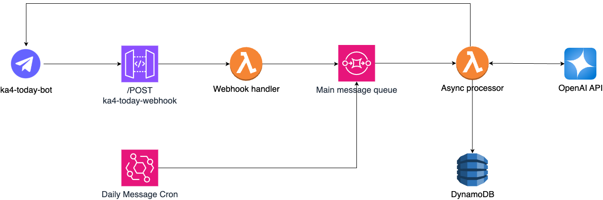

# ka4-today-bot

A lightweight, serverless Telegram bot built with AWS Lambda, OpenAI Assistants API, and Node.js.  
It processes a simple webhook message, interacts with OpenAI to generate a response, and sends it back via Telegram.

---

## 📐 Architecture


- **Telegram Webhook** is handled via **API Gateway (HTTP API)** → lightweight **Lambda**,  
  which pushes messages to an **Amazon SQS queue** instead of invoking the processor directly.
- **Amazon SQS** acts as a **decoupling layer and rate controller**,  
  enabling safe and scalable asynchronous processing.
- The **Async Processor Lambda** consumes messages from the SQS queue with controlled concurrency  
  (e.g. `MaximumConcurrency: 2`) to avoid hitting **OpenAI token limits**.
- Integration with **OpenAI Assistants API v2**: threads, runs, tool calls, file search support.
- **Structured logging** with semantic markers (`### LABEL:start/stop`),  
  distinguishing between API-level and low-level errors.
- **Custom HTTP client** with:
  - timeouts,
  - semantic `errorClass`,
  - optional hidden responses (for logging privacy or size constraints).
- **DynamoDB** for:
  - Telegram users (`chat_id`, `username`, etc.),
  - Prompt references,
  - Daily training schedule,
  - Invocation logs.

---

## ⭐ Features
- **Secure webhook** with x-telegram-bot-api-secret-token validation
- Handles /start command and registers user in DB
- Mark users as inactive users after receiving Telegram 403 errors (e.g., bot blocked)
- **Daily cron-based message broadcast** via ka4today-cron-daily-message Lambda
- **Personalized messages** based on OpenAI assistant and the day of the week
- **Localization support** for messages (multi-language)
- **Prompt dictionary** stored in DynamoDB for consistent responses
- **Personalized workout generation** custom daily workout plan for the user, based on their preferences and available exercise
---

## 🧩 Project Structure

```
src/
├── config/              # Environment variables and constants
├── handlers/            # Lambda entrypoints
├── services/            # Core business logic (Telegram, OpenAI, etc.)
├── utils/               # Shared helpers (http client, logger, poller, errors)
template.yaml            # AWS SAM template
.env.sample              # Local environment variables sample
```

---

## 🚀 Running Locally

> Requires Node.js 22+

1. Clone the repo
2. Copy a `.env.sample` file and rename it to `.env` :
3. Install dependencies:

```bash
npm install
```

4. Test individual handlers (via [AWS SAM CLI](https://docs.aws.amazon.com/serverless-application-model/latest/developerguide/serverless-sam-cli.html)):

Run entrypoint:
```bash
npm run local -- Ka4TodayTelegramWebhook event-samples/telegram-event.json
```

Run async processor
```bash
npm run local -- Ka4TodayAsyncTelegramProcessor event-samples/daily-workout.json
```

---

## ☁️ Deploying to AWS

> Requires [AWS SAM CLI](https://docs.aws.amazon.com/serverless-application-model/latest/developerguide/serverless-sam-cli-install.html) and configured AWS credentials.

### One-time setup:

```bash
sam build
sam deploy --guided
```

You will be prompted to enter your environment variables. These are saved to `samconfig.toml`.

### Or deploy manually:

```bash
sam deploy \
  --stack-name ka4-today-bot \
  --region eu-central-1 \
  --capabilities CAPABILITY_IAM \
  --parameter-overrides \
    TelegramBotToken=your-token \
    TelegramSecurityToken=your-secret \
    OpenAiToken=your-openai-key \
    OpenAiAssistantId=your-assistant-id
    OpenAiProjectId=your-openai-project-id 
```

## ☁️ Delete all from AWS

```bash
aws cloudformation delete-stack --stack-name ka4-today-bot
```

---

## 🛠️ Environment Requirements

- Node.js 22.x
- AWS CLI + AWS SAM CLI
- AWS account with permissions to:
  - Deploy Lambda functions
  - Manage API Gateway (HTTP API)
  - Create IAM roles
- Telegram bot with webhook access (set via `setWebhook` API)
- OpenAI Assistant API access (Beta)

---

## License
All Rights Reserved.
© [2025] [Vitalii Kyrychenko]

This code and associated content may not be copied, modified, or distributed without explicit written permission.
This project is intended as a personal exploration and demonstration only.

