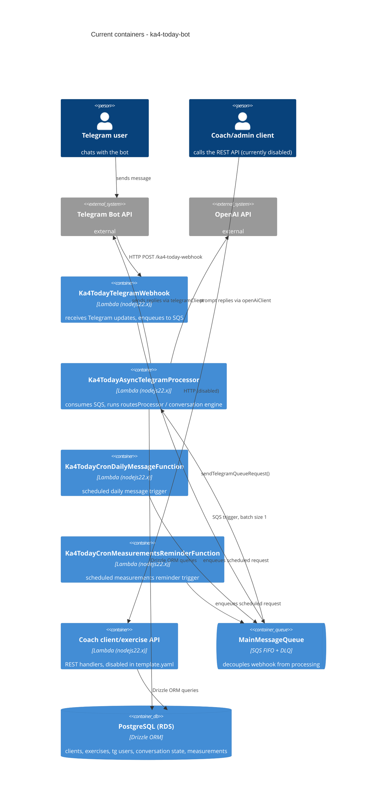

# Architecture map — ka4-today-bot

> The **current** architecture (what exists today), produced by `survey` and read by
> specify / design / data-model / implement. Refresh with `survey` when the repo drifts past
> `reflects_commit`. This is generated; a hand-maintained `docs/architecture.md`, if present, is
> authoritative and reconciled below, not replaced.

## Stack

- Language / runtime: TypeScript 5.8.2, Node.js 22.x ARM64 (`package.json:4`, `template.yaml:7-9`). `package.json` declares `"type": "module"` but `tsconfig.json:8` sets `"module": "commonjs"`; Lambdas are bundled to CJS by esbuild (`template.yaml` build `Metadata`).
- Frameworks / key deps: `drizzle-orm` 0.45.2 + `pg` 8.16.3 (Postgres), AWS SDK v3 clients (`@aws-sdk/client-s3`, `client-sqs`, `client-lambda`), `axios`, `satori` + `@resvg/resvg-js` (SVG-to-PNG chart rendering), `esbuild` 0.27.4 as build tool (`package.json:13-27`).
- Build / test / lint: build via `sam build` (esbuild under the hood); tests via `npm test` → `node --test "test/**/*.test.mjs"` (`package.json:9`); typecheck via `npm run typecheck` → `tsc --noEmit` (`package.json:10`). No lint script or ESLint config present in the repo, no migration-tool config (no `drizzle.config.*`, no migrations directory) — schema is declared directly in Drizzle schema files with no generated migrations.

## C4 — system as it is

## Module inventory

| Module | Path | Layers | Wired at | Responsibility |
|---|---|---|---|---|
| telegram | `src/modules/telegram/` | handlers / routes / features / repository / model / api | `src/modules/telegram/handlers/asyncTelegramProcessor.ts:8` | Telegram bot: webhook intake, routing, conversations, prompts, measurements |
| coach | `src/modules/coach/` | client, exercise (each: handlers / application / domain / repository / api), workout (reserved) | `src/modules/coach/client/handlers/clients.ts:1-27` | Coach/admin REST API over clients and exercises (currently disabled in `template.yaml`) |
| shared | `src/shared/` | logging, errors, http, types, i18n, pagination, utils | imported directly by handlers/services, no central registration | Cross-cutting helpers used by both product modules |
| infrastructure/integrations | `src/infrastructure/integrations/` | telegram, openai HTTP clients | `src/infrastructure/integrations/telegram/telegramClient.ts` | Low-level third-party HTTP clients |
| infrastructure/persistence/postgres | `src/infrastructure/persistence/postgres/` | schema / models / mappers / `postgresDb.ts` | `src/infrastructure/persistence/postgres/postgresDb.ts:73` (`getPostgresDb()`) | Postgres connection pool, Drizzle schema, row↔domain mappers |
| infrastructure/persistence/dynamodb/legacy | `src/infrastructure/persistence/dynamodb/legacy/` (path reserved by AGENTS.md, not present in current source) | n/a | n/a | AGENTS.md reserves this path for legacy DynamoDB compatibility code, but no such code exists in `src/` today; only `docker/dynamodb-local.yml` (local dev tooling, unused by active handlers) references DynamoDB |
| app | `src/app/` | config (`env.js`, `constants.js`), `withAppInitialization.ts` | `src/app/withAppInitialization.ts` wraps every handler | Environment config + per-invocation app bootstrap (Postgres pool init) |

## Conventions (cited)

- **Module wiring / registration:** no DI container; services exported as `export const xService = {...}` and imported directly (e.g. `bodyMeasurementService` in `src/modules/telegram/features/measurements/bodyMeasurementService.ts:13-15`).
- **Error handling:** typed error classes in `src/shared/errors/index.ts:1-63` (`BadRequestError`, `HttpApiError`, `NotFoundError`, `OpenAIError`, `TelegramError`); handlers catch and log via `toShortErrorLog()` (`src/shared/errors/index.ts:51`).
- **IDs:** Postgres auto-generated numeric primary keys (e.g. `ClientItem.id`, `src/modules/coach/client/domain/client.ts`); Telegram `chatId` is the numeric ID from the Telegram API. No UUID/nanoid generation observed.
- **Persistence / DB access:** singleton pooled connection via `getPostgresDb()` (`src/infrastructure/persistence/postgres/postgresDb.ts:29-40,73`), Drizzle ORM; repositories call schema + mappers, e.g. `src/modules/coach/client/repository/clientsRepository.ts`.
- **Migrations:** none present, no `drizzle.config.*`, no migrations directory, schema is declared directly in `src/infrastructure/persistence/postgres/schema/*.ts`. `data-model` should treat this as an UNKNOWN/no-migration-tool repo rather than assume one.
- **Tests:** `node:test` + `node:assert`, TypeScript source bundled on the fly via `esbuild` inside the test file itself, e.g. `test/modules/telegram/features/conversations/conversationEngine.multiStep.test.mjs`.
- **Inter-module communication:** async decoupling via SQS FIFO (`MainMessageQueue`, `template.yaml:255-263`, DLQ `template.yaml:249-253`); webhook enqueues, async processor Lambda (`src/modules/telegram/handlers/asyncTelegramProcessor.ts:7-27`) consumes (batch size 1). Coach and telegram modules do not call each other directly or via events, they are independent Lambda functions.
- **UI / styling:** N/A, no frontend in this repo (see below).

## Datastores

| Store | Engine | Accessed via | Notes |
|---|---|---|---|
| PostgreSQL (RDS) | Drizzle ORM over `pg` | `src/infrastructure/persistence/postgres/postgresDb.ts` singleton pool (`max: 5`, `statement_timeout` from `POSTGRES_TIMEOUT_MS`) | Primary and only datastore in current code: clients, exercises, tg users, conversation state, measurements, prompts |
| DynamoDB | none in `src/` today | `docker/dynamodb-local.yml` (local-dev tooling only) | No DynamoDB code exists in current source; AGENTS.md reserves `src/infrastructure/persistence/dynamodb/legacy/` for legacy compatibility code but that path is not present |

## Frontend / UI foundation

<!-- N/A: no frontend -->
No frontend/UI code exists in this repository. This is a backend-only project: a Telegram bot plus a (currently disabled) coach admin REST API. A Telegram mini-app HTTP handler exists (`src/modules/telegram/handlers/bodyMeasurements.ts`, exposed via `src/modules/telegram/api/index.ts`) but it is a JSON API, not UI code, and it is disabled in `template.yaml:312`. `assets/` holds only a font (`Inter-Regular.ttf`) and images used for server-side chart rendering via `satori`, not a UI layer.

## Where things live / closest precedents

- A new **Telegram bot command/route** → `src/modules/telegram/routes/`, modelled on `src/modules/telegram/routes/ProgressRoute.ts` or `DailyWorkoutRoute.ts`, registered in `src/modules/telegram/routes/registry.ts` and dispatched by `src/modules/telegram/routes/routesProcessor.ts:15-24`.
- A new **multi-step conversation** → `src/modules/telegram/features/conversations/`, modelled on `engine.ts` + `registry.ts`, with state persisted via `src/modules/telegram/repository/tgConversationStateRepository.ts`; conversations take priority over routes (`routesProcessor.ts:24`).
- A new **Telegram feature service** (like measurements) → `src/modules/telegram/features/<name>/`, modelled end-to-end on `src/modules/telegram/features/measurements/bodyMeasurementService.ts` (handler → service → repository → domain), tested per `test/modules/telegram/features/measurements/bodyMeasurementsConversation.test.mjs`.
- A new **coach REST resource** → `src/modules/coach/<resource>/{handlers,application,domain,repository,api}/`, modelled end-to-end on `src/modules/coach/client/` (handler `handlers/clients.ts` → one-file-per-operation in `application/` → `domain/client.ts` → `repository/clientsRepository.ts` → `src/infrastructure/persistence/postgres/mappers/clientMapper.ts`).
- A new **low-level external integration** → `src/infrastructure/integrations/<provider>/`, modelled on `telegramClient.ts` / `openAiClient.ts`.
- A new screen / UI component → N/A, no frontend exists in this repo.

## Constraints & known tech-debt

- No migration tooling exists for the Postgres schema (no `drizzle.config.*`, no migrations dir) — schema changes today happen by hand-editing Drizzle schema files with no generated/reversible migration. A feature that changes the schema should flag this gap explicitly rather than assume a migration workflow exists.
- The coach admin API (`src/modules/coach/*/api/index.ts`) is defined but disabled in `template.yaml` (e.g. line 344) — treat it as not-yet-live; changes there don't affect a running endpoint until it's re-enabled.
- AGENTS.md reserves `src/infrastructure/persistence/dynamodb/legacy/` for legacy DynamoDB compatibility code and says it should not be expanded; that path does not currently exist in `src/`, so there is nothing to preserve, but new persistence work should still go through Postgres/Drizzle, not DynamoDB.
- `tsconfig.json` targets `commonjs` module output while `package.json` declares `"type": "module"` — build correctness currently depends on esbuild's CJS bundling in `template.yaml`, not on `tsc` output; be careful with any change to build tooling.
- The "is this Telegram user a client" eligibility check is duplicated per feature instead of centralized: `src/modules/telegram/features/workoutLogging/workoutLoggingConversation.ts` (`onStart`, before starting the conversation) and `src/modules/telegram/features/measurements/bodyMeasurementsConversation.ts` (`saveMeasurements`, at save-time) each re-implement `clientId == null` handling; `src/modules/telegram/handlers/bodyMeasurements.ts` has a third variant for the Mini App HTTP path. `src/modules/telegram/routes/routesProcessor.ts` has no such gate today, and several routes (`StartRoute`, `DefaultRoute`, `DailyGreetingRoute`) intentionally must keep working for non-clients, so a blanket gate in `buildContext` would be wrong. If a third Telegram conversation/feature needs the same client-only gate, consider a per-route opt-in (e.g. a `requiresClient` flag on `BaseRoute`, mirroring the existing `conversationType` flag) checked in `routesProcessor.execute` after route matching, rather than duplicating the check again.
- `src/modules/telegram/features/prompts/promptReplyService.ts` (`normalizeLang`) maps the `uk` language code to `ua` at lookup time because prompts are stored in the `dict_prompt`/system-prompt `prompts` JSON under the `ua` key. Consider migrating stored prompts to use the correct ISO code `uk` instead of `ua`, then removing this normalization.

## Reconciliation with the authored architecture doc

No authored `docs/architecture.md`/`ARCHITECTURE.md`/ADRs exist. `AGENTS.md` (root, referenced by `CLAUDE.md`) documents intended structure and conventions and was used as a cross-check input; this map reflects the actual current code, which matches AGENTS.md's described layout closely (module folders, mapper boundary, logging import style, test conventions) with no drift found. This map is the current reference.
