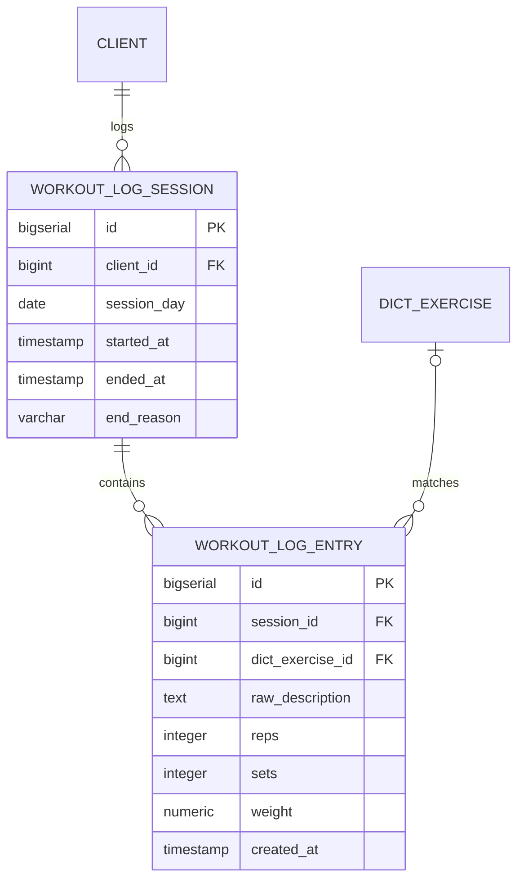

# Data model — workout-logging

## ER diagram

`CLIENT` and `DICT_EXERCISE` are existing tables (`client`, `dict_exercise`), not introduced by this feature — shown only as relationship endpoints.

## Entities

### `workout_log_session`

**Aggregate root.** New table (ADR-0004). Written at session start (AC-01), updated once at close.

| Column | Type | Constraints | Notes |
|---|---|---|---|
| `id` | bigserial | PK | repo's numeric-PK convention (SAD §2) |
| `client_id` | bigint | NOT NULL, FK → `client(id)` | the logging client (AC-02); indexed below |
| `session_day` | date | NOT NULL | the session's start day in the client's local time; every entry in the session is attributed to this day regardless of when logged (AC-13) — set once at session start, never recomputed |
| `started_at` | timestamp | NOT NULL | session-open instant; the base for AC-11's 2h-inactivity window when no entry has been recorded yet |
| `ended_at` | timestamp | NULL while open | set once the session closes, by any of the three closing paths below; `NULL` is the "currently open" marker read by the pre-emption/expiry flow (sad.md §6 Flow 2) |
| `end_reason` | varchar(20) | NULL while open | one of `client-ended` (AC-09/AC-09b explicit end) / `auto-closed` (AC-11 lazy expiry) / `pre-empted` (AC-10 cross-context pre-emption) — literal values match sad.md §6 Flow 2/3 |

**Access patterns:**
- find the client's currently-open session (to close it on pre-emption/expiry, sad.md §6 Flow 2) → `client_id` + `ended_at IS NULL` → index `idx_workout_log_session_client_id`.
- §7 KPIs (weekly active loggers, session completion rate) group by `client_id` and filter on `end_reason` → same index.

**Constraints:** FK → `client(id)`; a partial unique index enforces QG-3 (session-state consistency) as a DB-level backstop to the app-level check already done via `tg_conversation_state` (ADR-0003) — see Indexes.

### `workout_log_entry`

**Belongs to:** `workout_log_session` (aggregate root above).

| Column | Type | Constraints | Notes |
|---|---|---|---|
| `id` | bigserial | PK | |
| `session_id` | bigint | NOT NULL, FK → `workout_log_session(id)` | indexed below |
| `dict_exercise_id` | bigint | NULL, FK → `dict_exercise(id)` | `NULL` when unlinked — no candidate matched (AC-05b), client kept their own description (AC-06), or the AC-08 unparsed fallback; indexed below |
| `raw_description` | text | NOT NULL | the client's original free-text wording — always kept, and the sole content for an unlinked or AC-08 raw-wording entry |
| `reps` | integer | NULL | `NULL` only for the AC-08 fallback, where the retried message still could not be parsed at all |
| `sets` | integer | NULL | same as `reps` |
| `weight` | numeric(5,1) | NULL | `NULL` when the exercise doesn't use external weight (AC-03), or unparsed (AC-08); precision matches the existing `body_measurement_log.amount` convention |
| `created_at` | timestamp | NOT NULL | when the entry was saved (on confirm, on keep-own-description, or on the AC-08 fallback save) |

**Access patterns:**
- count/list a session's entries to decide the empty-vs-recorded outcome at close (AC-09/AC-09b, sad.md §6 Flow 3) → `session_id` → index `idx_workout_log_entry_session_id`.
- §7 catalog-match-rate KPI (linked vs. free-text share) → `dict_exercise_id IS NULL`/`IS NOT NULL` → index `idx_workout_log_entry_dict_exercise_id`.

**Constraints:** FK → `workout_log_session(id)`; FK → `dict_exercise(id)`.

<!-- No CHECK constraints added — the repo's existing schema (client, tg_conversation_state, body_measurement_log, ...) never uses CHECK/DB-level enums; end_reason follows the same varchar-with-app-level-values pattern as client.status. -->

## Indexes

| Index | Columns | Query it serves |
|---|---|---|
| `idx_workout_log_session_client_id` | `workout_log_session(client_id)` | FK safety + find-open-session-by-client (sad.md §6 Flow 2) + §7 KPI grouping |
| `uq_workout_log_session_open_client` | `workout_log_session(client_id)` WHERE `ended_at IS NULL` | partial unique index — enforces QG-3 (a client never has more than one open session) as a DB-level backstop; also serves the same find-open-session lookup |
| `idx_workout_log_entry_session_id` | `workout_log_entry(session_id)` | FK safety + entry count/list per session (AC-09/AC-09b, sad.md §6 Flow 3) |
| `idx_workout_log_entry_dict_exercise_id` | `workout_log_entry(dict_exercise_id)` | FK safety + §7 catalog-match-rate KPI |

## Test fixtures

No fixture-factory convention exists yet in this repo's test suite (each `test/**/*.test.mjs` builds its literal objects inline, e.g. `conversationEngine.multiStep.test.mjs`). No `workoutLogging` domain code exists yet to build fixtures against, so none are generated here — `implement`/`test-author` should follow the same plain-object-literal style when the first workout-logging test is written:

- a `WorkoutLogSession` literal: `{clientId: 777, sessionDay: '2026-08-23', startedAt: '2026-08-23T10:00:00.000Z', endedAt: null, endReason: null}`.
- a `WorkoutLogEntry` literal: `{sessionId: 1, dictExerciseId: null, rawDescription: 'bench press 4x10 60kg', reps: 10, sets: 4, weight: 60}`.

No PII in either shape — client identity is a synthetic numeric id, matching the existing test's `clientId: 777`.
