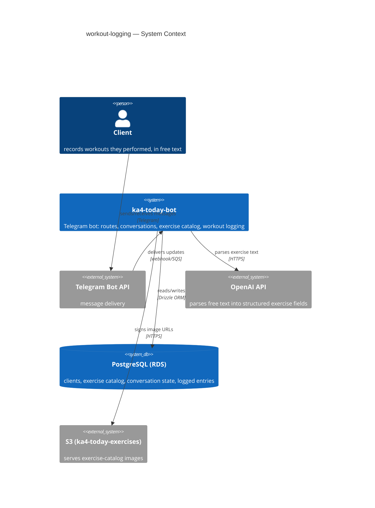
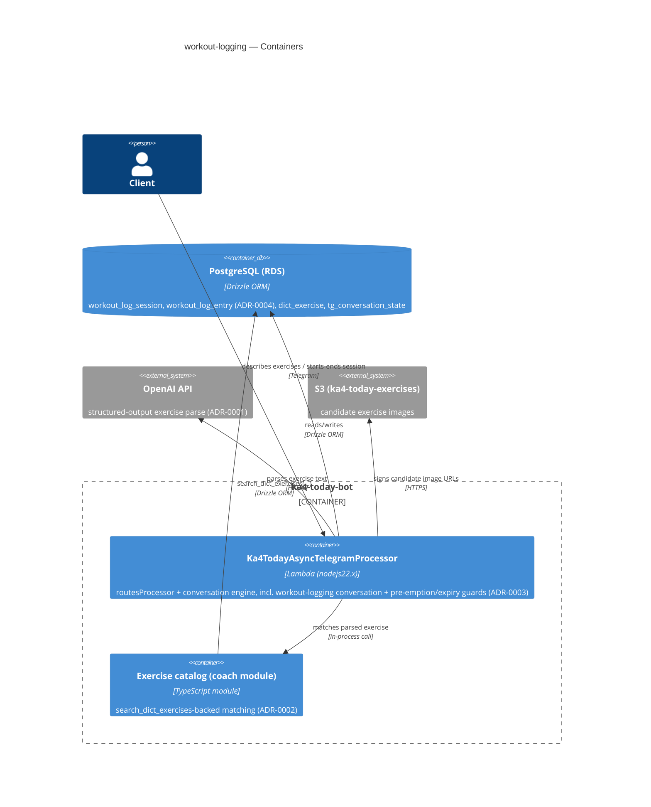
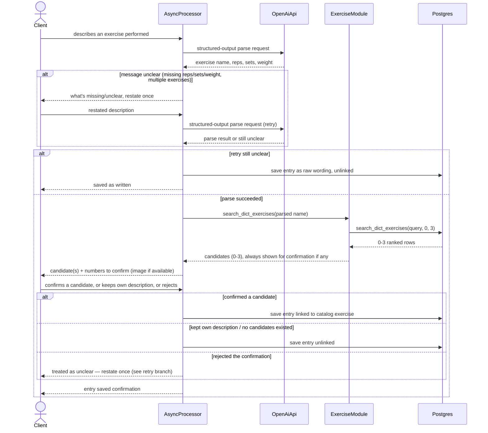
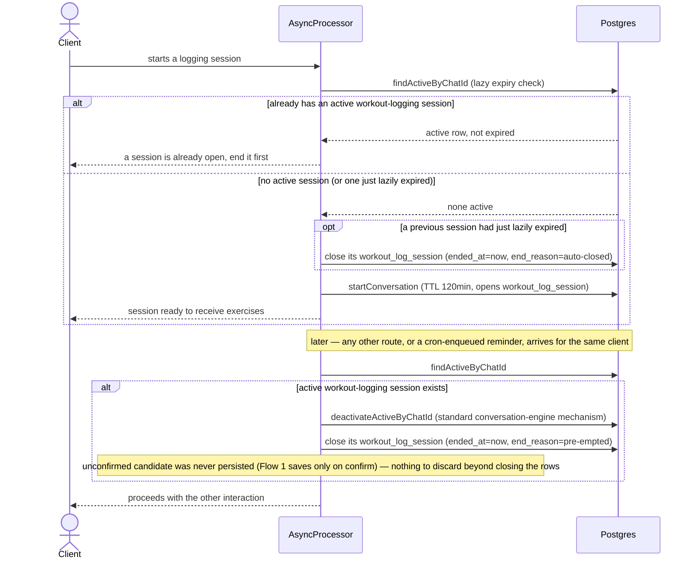

# Software Architecture Document — workout-logging

<!-- 12 Arc42 sections. Empty section → <!-- N/A: <one-line reason> -->. -->
<!-- C4 Context (L1) lives inline in §3. C4 Container (L2) lives inline in §5. -->
<!-- Numbers in §10 come VERBATIM from spec.md §6 NFR — no inventing, no rounding. -->

## 1. Introduction and goals

**Intent.** Give clients a low-friction way to record what they actually did in the gym, in free text and their own language, linking back to the exercise catalog whenever a confident match exists — closing the gap where every workout is invisible once it's finished.

**Top-3 quality goals (1-liners; full scenarios in §10):**

1. **Trustworthy capture** — nothing is ever silently misrecorded; every exercise+numbers pair is shown back and confirmed before it's saved (AC-03/05/06/07 — the feature's actual differentiator), with one named exception: AC-08 saves the client's original wording unconfirmed only after a restated message also fails to parse.
2. **Responsiveness** — parse+confirm round trip ≤5000ms p95; start/end acknowledgement ≤300ms p95 (spec §6 NFR).
3. **Session-state consistency** — a client never has more than one open logging session at a time (AC-01/04/10/11/12).

**Stakeholders.**

| Role | Interest | Sign-off owner? |
|---|---|---|
| Client | records their own workouts in free text | No |
| Tech Lead | SAD approval | Yes |
| Security Lead | reviews personal-data handling (reps/weight/free text) | No |

<!-- Decision overrides (¶4) — populated by the critic resolution loop, empty otherwise. -->

## 2. Constraints

**Technical.**
- TypeScript 5.8.2, Node.js 22.x ARM64 (Lambda), ESM source bundled to CJS via esbuild
- `drizzle-orm` 0.45.2 + `pg` 8.16.3 (PostgreSQL/RDS) — the only datastore
- AWS SDK v3 (`@aws-sdk/client-s3` already used for exercise images, `@aws-sdk/client-sqs` for the existing async queue)
- Architecture convention: layered modules (`handlers/ → features/ or routes/ → repository/ → domain`), no DI container, services exported as `export const xService = {...}`

**Organisational.**
- Effort budget: `<TBD by PM>`
- Deadline: `<TBD by PM>` — see §11 open-question row
- Team composition: not stated

**Conventions.**
- `AGENTS.md` + `docs/architecture-map.md` — 4-space indent, semicolons, single quotes, named exports, mapper boundary (row↔domain) for persistence
- ID strategy: Postgres `bigserial` numeric PK (repo convention — no UUID/nanoid)
- No migration tooling exists (no `drizzle.config.*`, no migrations dir) — schema is hand-edited directly in Drizzle schema files; any new table for this feature inherits that gap

**Regulatory / external.**
- Data classification: Internal — same tier as existing body-measurement logs (spec §6.1)
- No new authorization boundary — only an already-registered client can act (AC-02)

## 3. Context and scope

The Telegram bot already delivers coach-prescribed plans and reminds clients about body measurements. This feature adds the one capability still missing: a client-initiated conversation to record what they actually performed, matched against the same read-only exercise catalog the prescribed-plan flow already uses, and persisted as the client's own training history.

<!-- brownfield: ka4-today-bot — Telegram webhook → SQS → async processor Lambda (routesProcessor + conversation engine) → Postgres/Drizzle; exercise catalog + OpenAI integration + S3 image signing already exist (docs/architecture-map.md, reflects 1f46d76) -->

**External systems (in / out):**

| Actor or system | Type | Interaction |
|---|---|---|
| Client | Person | starts/ends a logging session, describes exercises in free text |
| Telegram Bot API | System (external) | delivers/receives chat messages |
| OpenAI API | System (external) | parses free-text exercise descriptions into structured fields |
| PostgreSQL (RDS) | System (internal datastore) | exercise catalog, client/conversation state, logged entries |
| S3 (`ka4-today-exercises`) | System (external) | serves exercise-catalog images via signed URL |

**C4 Context (L1):**



## 4. Solution strategy

**Target surface:** `backend-service` only — this feature extends the existing Telegram bot backend (a new conversation type + a session-lifecycle wiring); no new UI, mobile, desktop, or CLI surface is introduced.

**Top strategic choices (the seeds for ADRs):**

1. **OpenAI structured-output parse** (ADR-0001) — one OpenAI call per exercise message, using the existing client's JSON-mode support, extracts exercise name/reps/sets/weight regardless of language (AC-14). Chosen over a deterministic regex/keyword parser, which cannot satisfy the any-language requirement.
2. **Reuse `search_dict_exercises` for catalog matching** (ADR-0002) — the OpenAI-normalized exercise name is matched via `search_dict_exercises(query, 0, 3)`; 3 is a pagination limit, not a required count — 0 rows is a no-match outcome (AC-05b), 1–3 rows are always shown to the client for confirmation (AC-05), since the spec never has the system auto-accept a match without confirmation. Chosen over introducing a new embedding/pgvector search, which would add new infrastructure this repo has no migration tooling to manage safely.
3. **Lazy TTL-based session expiry, no new cron** (ADR-0003) — session-state invariants (no double-start AC-12, cross-context pre-emption AC-10, 2h auto-close AC-11) are enforced by extending the conversation engine's existing `expires_at` lazy-check mechanism and wiring pre-emption into `routesProcessor` (a single call site — cron-triggered reminders already reach it as synthetic webhook messages), rather than adding a dedicated scheduled sweep. Accepted trade-off: auto-close is discovered on next check, not proactively pushed to the client — flagged in §11.
4. **Session record + entries persistence** (ADR-0004) — a new `workout_log_session` (with `end_reason`) plus `workout_log_entry` table, so §7's completion-rate KPI and AC-09b's empty-session exclusion have a durable row to read, rather than deriving session boundaries from the transient conversation-state row.

Each tactical decision in later sections traces to one of these four seeds.

## 5. Building block view

Layered, mirroring the repo's existing Telegram feature convention (handler → feature service → repository → domain) — no divergence from `docs/architecture-map.md`. `workout-logging` is a new feature folder alongside `features/measurements/`, registered as a new conversation type; it reads the exercise catalog directly (in-process import, same Lambda, no network call) via the coach module's exercise repository, corrected to call the existing `search_dict_exercises` stored function (ADR-0002). No new Lambda or queue is introduced (ADR-0003) — the pre-emption/expiry guards extend the existing conversation engine and `routesProcessor`, which already handle both webhook-origin and cron-origin messages through the same code path.

**Internal decomposition:**

```
src/modules/telegram/features/workoutLogging/
├── workoutLoggingConversation.ts   <steps: WAITING_INPUT / WAITING_CONFIRMATION, mirrors bodyMeasurementsConversation.ts>
├── workoutLoggingService.ts        <parse via OpenAI (ADR-0001), match via exerciseRepository (ADR-0002), confirm/save/end orchestration>
├── repository/
│   └── workoutLogRepository.ts     <workout_log_session + workout_log_entry CRUD (ADR-0004)>
└── domain/
    └── workoutLogEntry.ts          <WorkoutLogSession / WorkoutLogEntry domain models>
```

**C4 Container (L2):**



## 6. Runtime view

**Critical flow 1: Record and confirm an exercise entry**



**Critical flow 2: Session lifecycle — start, pre-emption, lazy auto-expiry**



design seeds these two flows; `sequences` covers every remaining §5 acceptance criterion in a later stage.

## 7. Deployment view

No new deployment unit (ADR-0003) — `workout-logging` runs entirely inside the existing `Ka4TodayAsyncTelegramProcessor` Lambda, behind the existing `MainMessageQueue` SQS FIFO, at the existing batch-size-1 / concurrency profile. The new tables (`workout_log_session`, `workout_log_entry`) live in the same PostgreSQL/RDS instance under the existing pooled connection (`max: 5`).

**Monitoring:**
- No new metrics or timing instrumentation added for this feature — the spec's §6 NFR latency target is measured from the existing production-log signal already used for the slow-reply notice, as-is.
- OpenAI parse failures/timeouts logged via the existing `toShortErrorLog()` / `OpenAIError` path — no new error class needed.

**Scaling thresholds:**
- Matches the existing async-processing concurrency ceiling (spec §6 NFR: ≥2 concurrent logging exchanges per instance) — no separate scaling policy for this feature.

## 8. Crosscutting concepts

| Concept | Convention | Where defined |
|---|---|---|
| Logging | Structured `log()`/`logError()` from `shared/logging`, one-line calls | `AGENTS.md`, `shared/logging` |
| Authentication | Telegram chat identity + registered-client check (AC-02) | existing pattern, e.g. `bodyMeasurementsConversation.ts` |
| Error handling | Typed error classes (`OpenAIError`, `BadRequestError`) from `shared/errors`; the one-retry-then-raw-save fallback (AC-07/AC-08) is domain flow control tracked in conversation `data`, not an error path | `shared/errors/index.ts` |
| ID strategy | Postgres `bigserial` numeric PK | repo convention (§2) |
| Internationalisation | Reply language = the client's already-stored `lang` (from `tgUser`/`client`), never per-message detection (AC-14) | existing `i18nService` + `tgUserRepository` |
| Observability | No new metrics/instrumentation (§7) — existing production logs only | §7 |
| Events | N/A — no new queue/event introduced (ADR-0003) | — |

## 9. Architecture decisions

| # | Title | Status | Section |
|---|---|---|---|
| 0001 | Use OpenAI structured-output parse for exercise messages | Accepted | §4 |
| 0002 | Reuse search_dict_exercises for catalog matching | Accepted | §4 |
| 0003 | Reuse lazy TTL-based expiry for session auto-close, no new cron | Accepted | §4 |
| 0004 | Persist a first-class workout-log session record plus entries | Accepted | §4 |

ADR files live under `docs/features/workout-logging/adr/`.

## 10. Quality requirements

**QG-1. Trustworthy capture**
- **When:** a client's exercise message has been parsed and matched (or found to have no match).
- **Then:** the client is shown the combined exercise+numbers proposal and nothing is written to `workout_log_entry` until they confirm (AC-03/AC-05/AC-05b/AC-06/AC-07/AC-07b). The one named exception is AC-08: after a restated message also fails to parse, the original wording is saved unconfirmed.
- **How verify:** an integration test asserting no entry row exists before a confirmation action is processed, for the confirm/keep-own/reject branches, and that the AC-08 fallback path is the only one that saves without a confirmation.

**QG-2. Responsiveness**
- **When:** a client sends an exercise-description message, or a start/end session command.
- **Then:** parse+confirmation round trip ≤ 5000 ms p95; start/end acknowledgement ≤ 300 ms p95 (spec §6 NFR, verbatim).
- **How verify:** not independently verifiable per-feature in v1 — no new instrumentation was added (§7), so the existing production-log signal covers all bot activity, not this feature's flow specifically. Tracked as an accepted-debt row in §11.

**QG-3. Session-state consistency**
- **When:** a client with an already-open logging session attempts to start another, or any other route/scheduled reminder fires for them.
- **Then:** a client never has more than one open logging session at a time (AC-01/AC-04/AC-10/AC-11/AC-12).
- **How verify:** an integration test against `tgConversationStateRepository` asserting a second `startConversation` of the same type is blocked while one is active, and that a pre-emption/expiry check always leaves at most one active row per `chat_id`.

## 11. Risks and technical debt

| Risk / debt | Severity | Mitigation | Owner |
|---|---|---|---|
| AC-11 requires the session to actively close "without waiting for the client's next message"; the chosen lazy-TTL mechanism (ADR-0003) only discovers expiry on the next check, not proactively | Medium | Accepted trade-off per explicit direction to add no new cron; revisit with a dedicated sweep (ADR-0003's rejected Option 1) if staleness becomes a real client complaint | Backend |
| `search_dict_exercises` (the catalog-matching function, ADR-0002) exists only in the live database, untracked by any migration — consistent with the repo's known no-migration-tooling gap (§2) | Medium | Document its exact signature/behavior in the upcoming `data-model` stage; no rollback path if it changes underneath this feature | Backend |
| `exerciseRepository.search()`'s current inline SQL does not call the real production search function and must be corrected as part of this feature (ADR-0002) | Medium | Fix folded into this feature's task breakdown, not deferred | Backend |
| Two new hand-edited tables (`workout_log_session`, `workout_log_entry`, ADR-0004) with no migration tooling to manage or roll them back | Medium | Follow the existing hand-edit convention carefully; no automated rollback available if the schema needs correction post-deploy | Backend |
| OpenAI dependency for every exercise message (ADR-0001) — cost and reliability of an external call on the write path | Medium | Bounded by the existing one-retry cap (AC-08, spec §6.1) — a message either resolves or falls back to a raw save, never loops | Backend |
| Fixing `exerciseRepository.search()` to call `search_dict_exercises` (ADR-0002) also changes results for its existing caller, the coach exercise-search API — currently disabled in `template.yaml`, so no live impact today, but re-enabling it later inherits this feature's matching behavior | Low | No action needed while the API stays disabled; re-verify search behavior for that API if/when it's re-enabled | Backend |
| Open question: feature deadline/effort budget | Open question | Resolve before `tasks`; no deadline stated in spec | PM |

**Accepted debt (acceptable in v1, plan to fix later):**
- Session records carry no edit/audit history — acceptable for a write-only v1 (spec §3 non-goal: no viewing/editing past entries yet).
- QG-2's latency targets (§10) are not independently verifiable per-feature in v1 — no new instrumentation was added (§7), so only the existing, untagged production-log signal covers this feature's flow.

## 12. Glossary

| Term | Meaning |
|---|---|
| Client | The person receiving coaching through the Telegram bot, identified by their Telegram chat and a linked client record (repo-root `CONTEXT.md`). |
| Logging session | An explicit, client-started period during which one or more exercise entries are recorded; ended explicitly, by pre-emption, or by lazy auto-expiry (feature `CONTEXT.md`). |
| Exercise entry | One record of a single exercise actually performed, captured from free text, holding its identity (catalog-linked or free-text) plus reps/sets/weight (feature `CONTEXT.md`). |
| Candidate | One of up to 3 catalog exercises `search_dict_exercises` ranks as a possible match for a parsed exercise description (0–3 results; the limit is pagination, not a required count) — always shown for confirmation, never auto-accepted (AC-05) — surfaced during this design pass, not yet in `CONTEXT.md`; recommend a `glossary` follow-up. |
| Unlinked entry | An exercise entry saved without a catalog reference — either no candidate matched, or the client kept their own description (AC-05b/AC-06) — surfaced during this design pass; recommend a `glossary` follow-up. |
