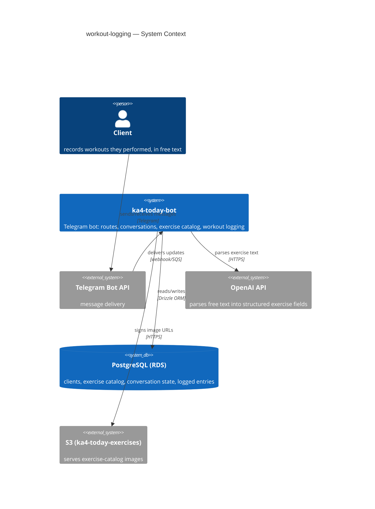

# Software Architecture Document — workout-logging

<!-- 12 Arc42 sections. Empty section → <!-- N/A: <one-line reason> -->. -->
<!-- C4 Context (L1) lives inline in §3. C4 Container (L2) lives inline in §5. -->
<!-- Numbers in §10 come VERBATIM from spec.md §6 NFR — no inventing, no rounding. -->

## 1. Introduction and goals

**Intent.** Give clients a low-friction way to record what they actually did in the gym, in free text and their own language, linking back to the exercise catalog whenever a confident match exists — closing the gap where every workout is invisible once it's finished.

**Top-3 quality goals (1-liners; full scenarios in §10):**

1. **Trustworthy capture** — nothing is ever silently misrecorded; every exercise+numbers pair is shown back and confirmed before it's saved (AC-03/05/06/07/08 — the feature's actual differentiator).
2. **Responsiveness** — parse+confirm round trip ≤5000ms p95; start/end acknowledgement ≤300ms p95 (spec §6 NFR).
3. **Session-state consistency** — a client never has more than one open logging session at a time (AC-01/04/10/11/12).

**Stakeholders.**

| Role | Interest | Sign-off owner? |
|---|---|---|
| Client | records their own workouts in free text | No |
| Tech Lead | SAD approval | Yes |
| Security Lead | reviews personal-data handling (reps/weight/free text) | No |

<!-- Decision overrides (¶4) — populated by the critic resolution loop, empty otherwise. -->

## 2. Constraints

**Technical.**
- TypeScript 5.8.2, Node.js 22.x ARM64 (Lambda), ESM source bundled to CJS via esbuild
- `drizzle-orm` 0.45.2 + `pg` 8.16.3 (PostgreSQL/RDS) — the only datastore
- AWS SDK v3 (`@aws-sdk/client-s3` already used for exercise images, `@aws-sdk/client-sqs` for the existing async queue)
- Architecture convention: layered modules (`handlers/ → features/ or routes/ → repository/ → domain`), no DI container, services exported as `export const xService = {...}`

**Organisational.**
- Effort budget: `<TBD by PM>`
- Deadline: `<TBD by PM>` — see §11 open-question row
- Team composition: not stated

**Conventions.**
- `AGENTS.md` + `docs/architecture-map.md` — 4-space indent, semicolons, single quotes, named exports, mapper boundary (row↔domain) for persistence
- ID strategy: Postgres `bigserial` numeric PK (repo convention — no UUID/nanoid)
- No migration tooling exists (no `drizzle.config.*`, no migrations dir) — schema is hand-edited directly in Drizzle schema files; any new table for this feature inherits that gap

**Regulatory / external.**
- Data classification: Internal — same tier as existing body-measurement logs (spec §6.1)
- No new authorization boundary — only an already-registered client can act (AC-02)

## 3. Context and scope

The Telegram bot already delivers coach-prescribed plans and reminds clients about body measurements. This feature adds the one capability still missing: a client-initiated conversation to record what they actually performed, matched against the same read-only exercise catalog the prescribed-plan flow already uses, and persisted as the client's own training history.

<!-- brownfield: ka4-today-bot — Telegram webhook → SQS → async processor Lambda (routesProcessor + conversation engine) → Postgres/Drizzle; exercise catalog + OpenAI integration + S3 image signing already exist (docs/architecture-map.md, reflects 1f46d76) -->

**External systems (in / out):**

| Actor or system | Type | Interaction |
|---|---|---|
| Client | Person | starts/ends a logging session, describes exercises in free text |
| Telegram Bot API | System (external) | delivers/receives chat messages |
| OpenAI API | System (external) | parses free-text exercise descriptions into structured fields |
| PostgreSQL (RDS) | System (internal datastore) | exercise catalog, client/conversation state, logged entries |
| S3 (`ka4-today-exercises`) | System (external) | serves exercise-catalog images via signed URL |

**C4 Context (L1):**

## 4. Solution strategy

**Target surface:** `backend-service` only — this feature extends the existing Telegram bot backend (a new conversation type + a session-lifecycle wiring); no new UI, mobile, desktop, or CLI surface is introduced.

**Top strategic choices (the seeds for ADRs):**

1. **OpenAI structured-output parse** (ADR-0001) — one OpenAI call per exercise message, using the existing client's JSON-mode support, extracts exercise name/reps/sets/weight regardless of language (AC-14). Chosen over a deterministic regex/keyword parser, which cannot satisfy the any-language requirement.
2. **Reuse `search_dict_exercises` for catalog matching** (ADR-0002) — the OpenAI-normalized exercise name is matched against the catalog via the existing stored Postgres function, ranked into up to 3 candidates (AC-05) or a no-match outcome (AC-05b). Chosen over introducing a new embedding/pgvector search, which would add new infrastructure this repo has no migration tooling to manage safely.
3. **Lazy TTL-based session expiry, no new cron** (ADR-0003) — session-state invariants (no double-start AC-12, cross-context pre-emption AC-10, 2h auto-close AC-11) are enforced by extending the conversation engine's existing `expires_at` lazy-check mechanism and wiring pre-emption into `routesProcessor` + the cron-reminder handler, rather than adding a dedicated scheduled sweep. Accepted trade-off: auto-close is discovered on next check, not proactively pushed to the client — flagged in §11.
4. **Session record + entries persistence** (ADR-0004) — a new `workout_log_session` (with `end_reason`) plus `workout_log_entry` table, so §7's completion-rate KPI and AC-09b's empty-session exclusion have a durable row to read, rather than deriving session boundaries from the transient conversation-state row.

Each tactical decision in later sections traces to one of these four seeds.

## 5. Building block view

_pending Socratic walk_

## 6. Runtime view

_pending Socratic walk_

## 7. Deployment view

_pending Socratic walk_

## 8. Crosscutting concepts

_pending Socratic walk_

## 9. Architecture decisions

_pending Socratic walk_

## 10. Quality requirements

_pending Socratic walk_

## 11. Risks and technical debt

_pending Socratic walk_

## 12. Glossary

_pending Socratic walk_
