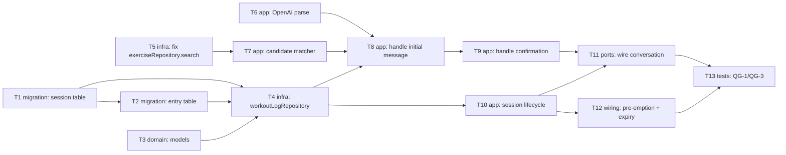

# Epic — workout-logging

> **Spec:** [spec.md](../spec.md) · **Design:** [sad.md](../sad.md) · **Data model:** [data-model.md](../data-model.md) · **ADRs:** [adr/](../adr/)

## Goal

Let a client record what they actually performed in the gym, one exercise per free-text message, matched against the exercise catalog and confirmed before saving, inside an explicit session (spec §2 Goals).

## Scope

- **In:** new `workout_log_session`/`workout_log_entry` tables, a new `workoutLogging` Telegram conversation (parse → match → confirm → save, session lifecycle, pre-emption/expiry wiring), a correction to `exerciseRepository.search()` (ADR-0002).
- **Out:** viewing/editing/deleting past entries, coach-facing review, catalog auto-reconciliation, adherence checks (spec §3).

## Task map

## Tasks

See [tracker.md](./tracker.md) for status. Machine contract: [tasks.json](../tasks.json).

| # | Task | Layer | Blocked by | DoD (short) |
|---|---|---|---|---|
| T1 | Promote workout_log_session staged migration | migration | — | up/down applies+reverts cleanly |
| T2 | Promote workout_log_entry staged migration | migration | T1 | up/down applies+reverts cleanly, FKs+indexes present |
| T3 | Add WorkoutLogSession/WorkoutLogEntry domain models | domain | — | unit tests on shape match data-model.md |
| T4 | Build workoutLogRepository for session + entry CRUD | infra | T1, T2, T3 | integration tests for find/start/close/addEntry |
| T5 | Fix exerciseRepository.search to call search_dict_exercises | infra | — | test confirms real DB function is called |
| T6 | Add OpenAI structured-output parse for exercise messages | app | — | unit tests, any-language, unclear detection |
| T7 | Build candidate-match confirmation payload | app | T5 | unit test, up to 3 candidates + images or none |
| T8 | Handle initial exercise-description message | app | T4, T6, T7 | unit test, nothing saved pre-confirmation |
| T9 | Handle exercise confirmation response | app | T8 | unit test, confirm/keep-own/reject/retry-fail branches |
| T10 | Implement session start/end lifecycle | app | T4 | unit test, start/end/empty-session/day-attribution |
| T11 | Wire workoutLoggingConversation into the conversation engine | ports | T9, T10 | integration test, full conversation round trip |
| T12 | Wire cross-context pre-emption and lazy auto-expiry | wiring | T10 | integration test, pre-emption + 2h auto-close |
| T13 | Add QG-1/QG-3 integration test coverage | tests | T11, T12 | QG-1 no-write-before-confirm, QG-3 single active session |

## Risks / Hard rules

- No entry may be written to `workout_log_entry` before a confirmation action, except the AC-08 unparsed-retry fallback (sad §10 QG-1) — T8/T9 must preserve this.
- At most one open `workout_log_session` per client at any time (sad §10 QG-3) — enforced at both app level (conversation engine) and DB level (`uq_workout_log_session_open_client`, T1).
- No new Lambda/queue/cron may be introduced (ADR-0003) — T12 must extend the existing lazy `expires_at` mechanism and `routesProcessor` call site only.
- This repo has no migration tooling (sad §2/§11) — T1/T2 apply the staged SQL directly per the existing hand-edit convention; no automated rollback exists post-deploy.
